# Roots 管理ダッシュボード 操作マニュアル

> 結婚式場向け タスク・手配物・LINEリマインド管理システム（Google Apps Script 製）の管理者向け完全ガイドです。
> 各メニューの使い方を、画面スクリーンショット付きで体系的に解説します。

---

## 目次

- [0. はじめに](#0-はじめに)
  - [0-1. このツールでできること](#0-1-このツールでできること)
  - [0-2. 画面の全体構成](#0-2-画面の全体構成)
  - [0-3. 全画面共通の操作と表示](#0-3-全画面共通の操作と表示)
  - [0-4. 用語とデータの全体像](#0-4-用語とデータの全体像)
- [1. 式場管理](#1-式場管理)
- [2. タスクマスター管理](#2-タスクマスター管理)
- [3. カップル管理](#3-カップル管理)
- [4. 送信ログ](#4-送信ログ)
- [5. システム操作](#5-システム操作)
- [6.（参考）タスクカレンダー](#6参考タスクカレンダー)
- [7. はじめての導入フロー（推奨手順）](#7-はじめての導入フロー推奨手順)
- [8. よくある質問・トラブルシューティング](#8-よくある質問トラブルシューティング)
- [付録A. 期限式（due_formula）の書き方](#付録a-期限式due_formulaの書き方)
- [付録B. 手配物テンプレートの自動コピーの仕組み](#付録b-手配物テンプレートの自動コピーの仕組み)

---

## 0. はじめに

### 0-1. このツールでできること

Roots 管理ダッシュボードは、**結婚式場ごとに、担当カップル（新郎新婦）の準備タスクと手配物を管理し、LINE で自動リマインドを送る**ための管理画面です。データはすべて Google スプレッドシートに保存され、この画面はその読み書きを行うフロントエンドです。

大きく分けて、次の5つの仕事をこの1画面で行えます。

| メニュー | 役割 | 主な操作 |
|---|---|---|
| **式場管理** | 式場（会場）の登録・稼働ON/OFF | 式場の追加、有効/無効の切替、情報確認 |
| **タスクマスター管理** | 「全式場共通のタスク」と「式場ごとのタスク」のひな型を整備 | タスクの追加・編集、手配物テンプレ設定、全式場への一括同期 |
| **カップル管理** | カップルの登録、進捗・手配物の管理 | カップル追加、タスクのチェック、手配物の増減、個別タスク追加 |
| **送信ログ** | LINE 送信メッセージ（ドラフト）の確認・編集 | メッセージ文面の編集、送信状態の変更 |
| **システム操作** | 一括リマインド送信、初期セットアップ、自動実行トリガー登録 | 運用の裏側の操作 |

> **想定ユーザー**：式場のプランナーを統括する運営管理者・本部スタッフ。

---

### 0-2. 画面の全体構成

画面は常に「**左：サイドバー（メニュー）**」＋「**右：メインエリア（選択中メニューの内容）**」の2カラム構成です。

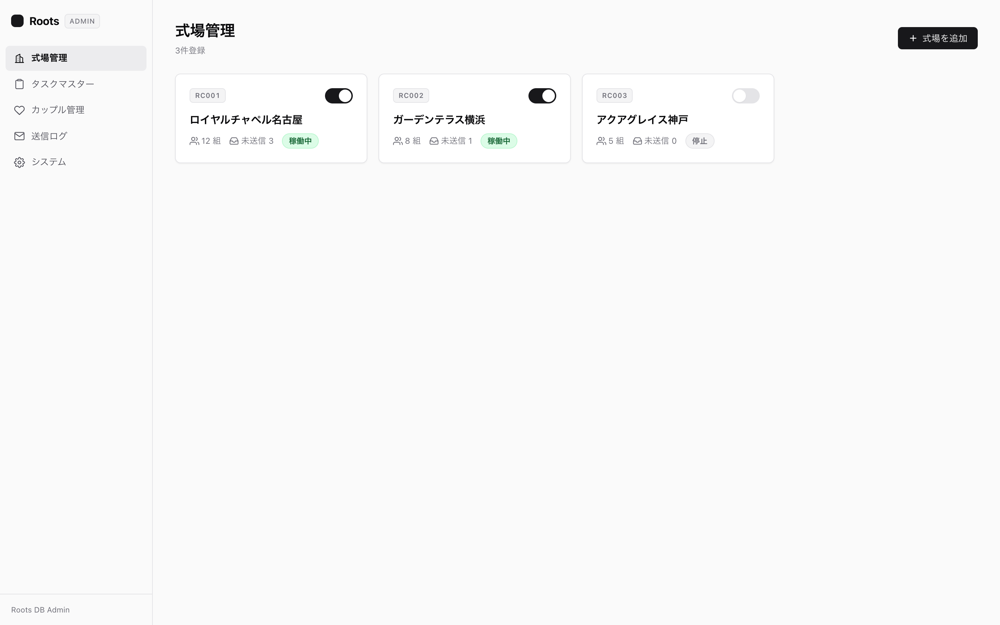

- **① ロゴ／ADMINバッジ**（左上）：このツールが管理者画面であることを示します。
- **② サイドバー**：クリックで各メニューに切り替わります。上から順に「式場管理 / タスクマスター / カップル管理 / 送信ログ / システム」。現在選択中の項目は背景がグレーでハイライトされます。
- **③ メインエリア**：選択中メニューの内容。見出し（例：「式場管理」）とその下に件数などの補足が表示されます。
- **④ 画面右上のアクションボタン**：そのメニューでの主操作（例：「＋ 式場を追加」）。

> サイドバー各項目の右端に**オレンジの小さな丸（●）**が点く場合があります。これは「キャッシュ表示中＝裏で最新データを取得中」を示すサインです（詳細は次項）。

---

### 0-3. 全画面共通の操作と表示

どのメニューでも共通する仕組みです。最初に覚えておくと迷いません。

#### キャッシュ表示と自動更新（SWR）
表示を速くするため、一度開いたデータは一時保存（キャッシュ）され、**次回は即座に前回の内容を表示 → 裏で最新を取得 → 自動で差し替え**ます。取得中は画面上部に黄色い帯「**キャッシュを表示中 — バックグラウンドで更新しています…**」が出ることがあります。数秒待てば最新化されます。

#### トースト通知（右下）
保存・追加・削除などが成功すると、画面右下に「**保存しました**」などの通知が数秒だけ表示されます（成功＝緑、エラー＝赤の縦ライン）。

#### 確認ダイアログ
削除や一括送信など**取り消せない／影響の大きい操作**の前には、必ず確認ダイアログが表示されます。「実行する」を押すまで処理は走りません。

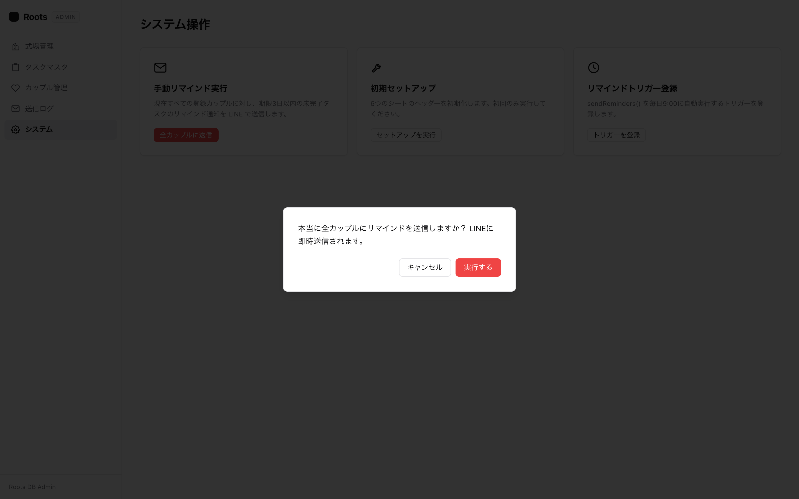

#### モーダル / ドロワー / シートの閉じ方
- 追加フォーム（モーダル）、詳細パネル（ドロワー／シート）は、**背景の暗い部分をクリック**するか、**キーボードの `Esc` キー**、または各パネルの「**閉じる / キャンセル / ✕**」で閉じられます。

#### 読み込み中
データ取得中は画面中央に**回転スピナー**が表示されます。

---

### 0-4. 用語とデータの全体像

| 用語 | 意味 |
|---|---|
| **式場（venue）** | 結婚式の会場。`RC001` のような式場IDで識別します。 |
| **カップル（customer）** | 新郎新婦。LINE の `line_id` で識別します。 |
| **タスク（task）** | カップルがこなす準備項目（例：招待状の発送）。 |
| **base task（ベースタスク）** | すべての式場で共通の標準タスクのひな型。式場登録時や同期時に各式場へコピーされます。 |
| **式場別タスク** | 特定の式場だけに存在するタスク。 |
| **個別タスク** | 特定の1組のカップルだけに追加したタスク。 |
| **手配物（item）** | 1つのタスクにぶら下がる持ち物・準備物（例：メインドレス、招待状80部）。 |
| **手配物テンプレート** | タスクに紐づく手配物のひな型。カップル登録・同期時に各カップルへ自動コピーされます。 |
| **ドラフト（draft）** | カップルへ送る LINE メッセージの下書き／送信記録。状態は `pending`（未送信）/ `sent`（送信済）/ `failed`（失敗）。 |
| **期限式（due_formula）** | 挙式日から期限を逆算する式（例：`挙式日 - 60日`）。→ [付録A](#付録a-期限式due_formulaの書き方) |
| **期限目安（due_estimate）** | 人が読むための目安ラベル（例：`挙式2ヶ月前`）。計算には使いません。 |

データは Google スプレッドシートの複数シート（式場・タスクマスター・カップル・進捗・メッセージ下書き・手配物・非表示タスク）に保存されます。これらの初期化は[システム操作](#5-システム操作)の「初期セットアップ」で行います。

---

## 1. 式場管理

**式場（会場）の登録と稼働状態の管理を行うメニューです。** ダッシュボードを開いたときの最初の画面でもあります。

### 画面の見方

各式場は**カード**で表示されます。1枚のカードに次の情報が並びます。

- **式場ID**（左上のタグ、例：`RC001`）
- **稼働トグル**（右上のスイッチ）：ON＝稼働中／OFF＝停止
- **式場名**（例：ロイヤルチャペル名古屋）
- **👥 ◯組**：その式場に登録されているカップル数
- **📥 未送信 ◯**：その式場でまだ送信していないドラフト数
- **稼働中 / 停止**バッジ：現在のステータス（緑＝稼働中／グレー＝停止）

見出し下の「**◯件登録**」で、登録式場の総数が分かります。

### 1-1. 式場を追加する

1. 右上の「**＋ 式場を追加**」をクリックします。
2. 追加フォーム（モーダル）が開きます。

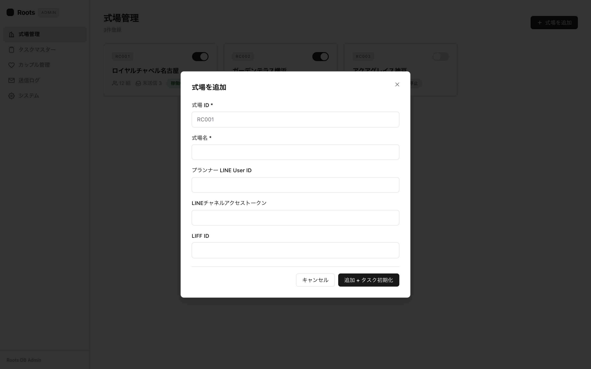

3. 各項目を入力します。

| 項目 | 必須 | 説明 |
|---|---|---|
| **式場 ID** | ✅必須 | 式場を識別するID。例：`RC001`。後からの変更は想定していないため、命名ルールを決めて入力してください。 |
| **式場名** | ✅必須 | 表示名。例：ロイヤルチャペル名古屋。 |
| **プランナー LINE User ID** | 任意 | テスト送信やリマインドの宛先になる、担当プランナーのLINE ユーザーID。 |
| **LINEチャネルアクセストークン** | 任意 | その式場のLINE公式アカウントから送信するためのトークン。LINEテスト送信や本番送信に必要です。 |
| **LIFF ID** | 任意 | LINEミニアプリ（LIFF）連携を使う場合のID。 |

4. 「**追加 + タスク初期化**」をクリックします。
   - 式場が登録されると同時に、**現在の base task が自動でこの式場にコピー**されます。
   - 成功すると「**式場を追加しました（タスク追加: ◯件）**」と通知が出ます。

> 💡 **ポイント**：先に[タスクマスター管理](#2-タスクマスター管理)で base task を整えておくと、式場追加と同時に標準タスク一式がセットされて効率的です。

### 1-2. 式場の稼働を ON / OFF する

カード右上の**トグルスイッチ**をクリックすると、その場で稼働状態が切り替わります（「有効にしました」／「無効にしました」と通知）。
停止中（グレー）の式場は運用対象から外す、といった使い分けに利用します。

> トグルはカード本体のクリックとは独立しています。トグルを押しても詳細パネルは開きません。

### 1-3. 式場の詳細を確認する

カードの**トグル以外の部分をクリック**すると、右側に詳細ドロワーが開きます。

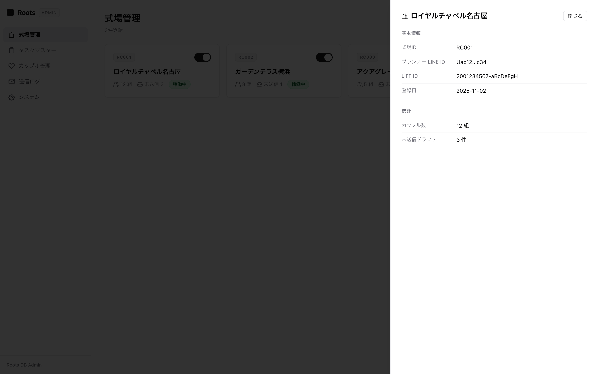

- **基本情報**：式場ID、プランナー LINE ID、LIFF ID、登録日
- **統計**：カップル数、未送信ドラフト数

確認したら「**閉じる**」または `Esc` で閉じます。

---

## 2. タスクマスター管理

**カップルへ展開する「タスクのひな型」を整備するメニューです。** ここで作ったタスクが、式場経由で各カップルの「やることリスト」になります。

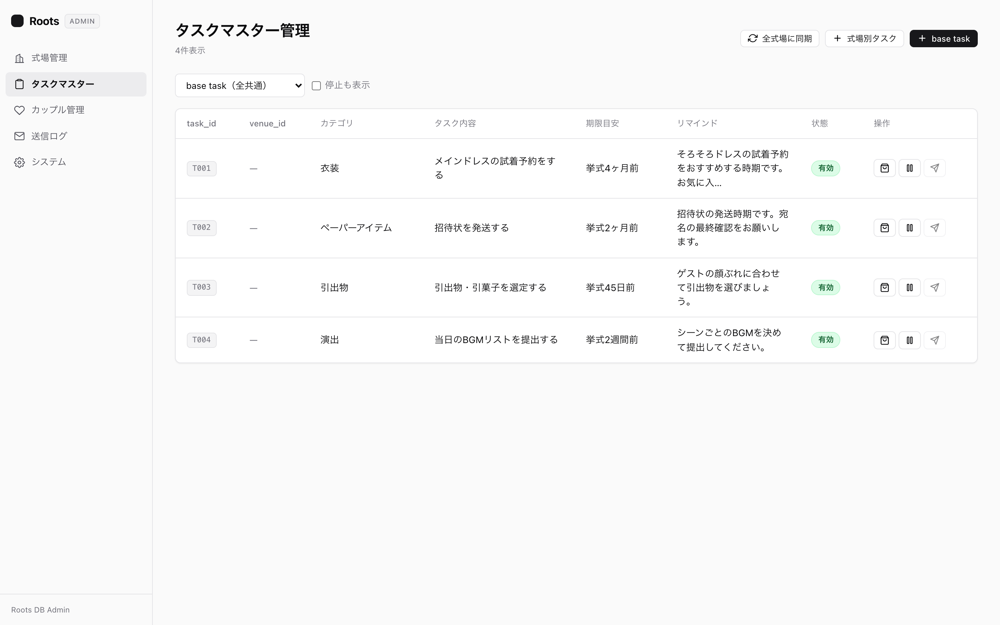

### 2-0. base task と式場別タスクの考え方

タスクには2つのレベルがあります。

- **base task（全共通）**：`venue_id` を持たず、すべての式場の標準となるタスク。
- **式場別タスク**：特定の式場だけのタスク（`venue_id` を持つ）。

画面上部の**ドロップダウン**で表示を切り替えます。
- 「**base task（全共通）**」を選ぶ → 共通タスク一覧（上のスクショの状態）
- 式場名を選ぶ → その式場のタスク一覧

その隣の「**停止も表示**」にチェックを入れると、停止中（無効）のタスクも一覧に出ます（既定では有効なタスクのみ表示）。

### 画面の見方（表の列）

| 列 | 内容 |
|---|---|
| **task_id** | タスクID。base task は `T123456`、式場別は `式場ID-CUST-xxxxxx` の形式。 |
| **venue_id** | 紐づく式場ID（base task は「—」）。 |
| **カテゴリ** | 衣装・ペーパーアイテム など分類。 |
| **タスク内容** | カップルに見せるタスクの本文。 |
| **期限目安** | 人が読む目安ラベル（例：挙式2ヶ月前）。 |
| **リマインド** | LINEで送るリマインド文面（先頭が抜粋表示）。 |
| **状態** | 有効（緑）／停止（グレー）。 |
| **操作** | 行ごとのボタン（下記）。 |

### 行の操作ボタン

各行の右端には次のボタンがあります（左から）。

- 🛍 **手配物テンプレートを設定**：このタスクに紐づく標準手配物を編集（→ [2-4](#2-4-手配物テンプレートを設定する)）。
- ⏸ / ▶ **停止 / 有効化**：タスクの有効・無効を切り替え。
- ✈ **LINEテスト送信**：プランナーへテスト送信（**式場を選んでいるときのみ有効**。base task では押せません）。
- 🗑 **削除**：**式場別タスク（CUST-付き）だけ**に表示。base task には削除ボタンは出ません（停止で無効化します）。

### 2-1. 既存タスクをその場で編集する（インライン編集）

**カテゴリ／タスク内容／期限目安／リマインド** のセルは、クリックするとその場で編集できます。

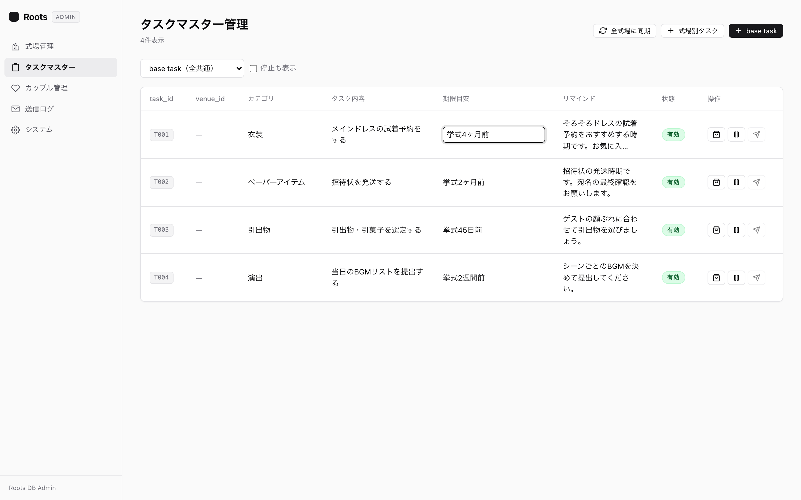

- 文字を直して **`Enter`** で保存（「保存しました」と通知）。
- **`Esc`** で取り消し。
- タスク内容・リマインドは複数行入力（テキストエリア）になります。

### 2-2. base task を追加する

1. 右上の「**＋ base task**」をクリック。
2. フォームが開きます。

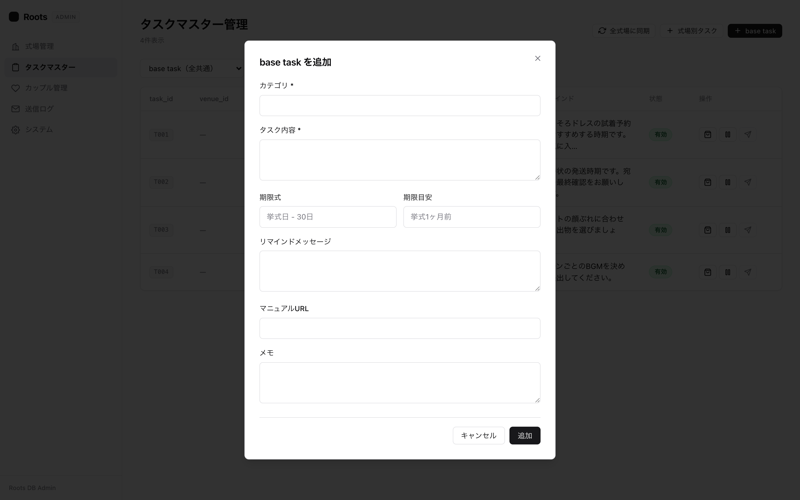

| 項目 | 必須 | 説明 |
|---|---|---|
| **カテゴリ** | ✅必須 | 例：衣装、引出物。 |
| **タスク内容** | ✅必須 | カップルに表示する本文。 |
| **期限式** | 任意 | 挙式日から逆算する式。例：`挙式日 - 30日`。→[付録A](#付録a-期限式due_formulaの書き方) |
| **期限目安** | 任意 | 表示用ラベル。例：挙式1ヶ月前。 |
| **リマインドメッセージ** | 任意 | LINEリマインドの文面。 |
| **マニュアルURL** | 任意 | 参考リンク。 |
| **メモ** | 任意 | 社内用の補足。 |

3. 「**追加**」で登録（`task_id` が自動採番されます）。

> base task を追加しただけでは既存式場には反映されません。**[2-5 全式場に同期](#2-5-全式場に同期する)** を実行すると各式場へコピーされます。

### 2-3. 式場別タスクを追加する

1. 右上の「**＋ 式場別タスク**」をクリック。
2. フォームが開きます（先頭で**対象式場を選択**します）。

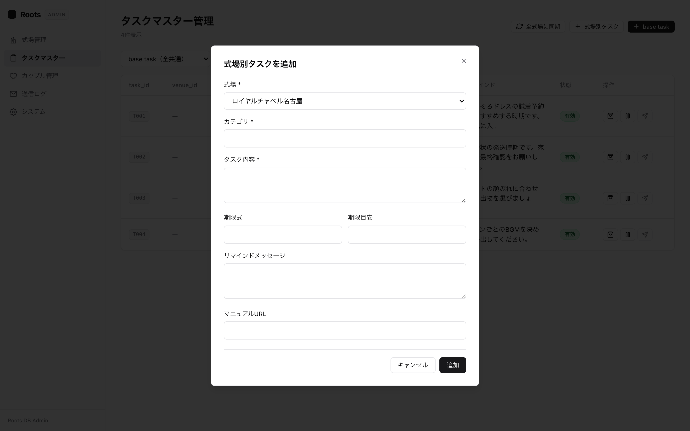

3. 式場を選び、base task と同じ項目を入力 → 「**追加**」。
   - `task_id` は `式場ID-CUST-xxxxxx` で採番され、その式場のタスクとして登録されます（削除可）。

### 2-4. 手配物テンプレートを設定する

タスクに「標準で必要な持ち物」を紐づけておく機能です。各行の 🛍 ボタンから開きます。

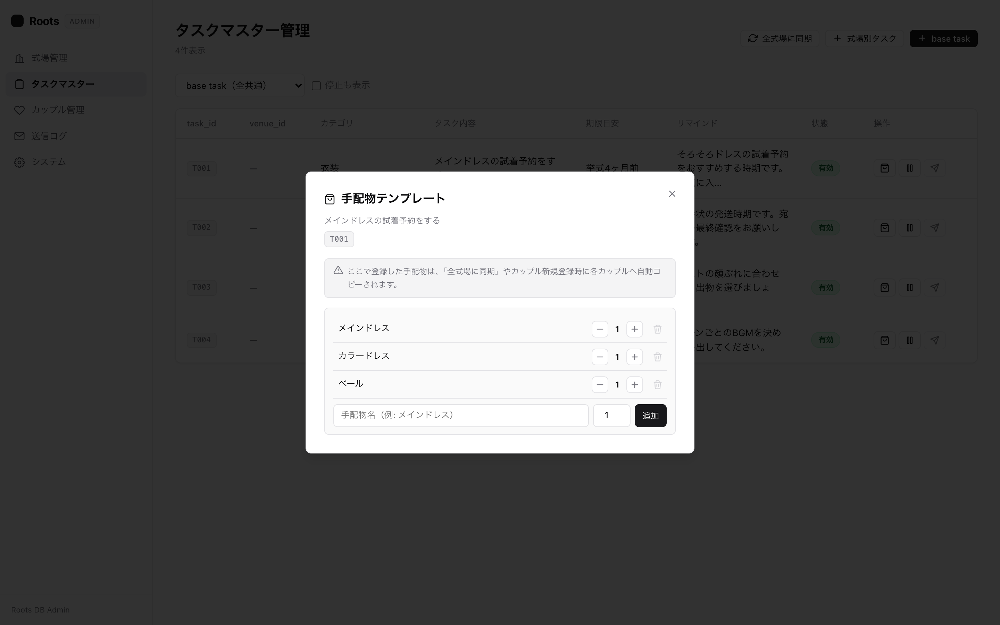

- **追加**：下段の入力欄に手配物名（例：メインドレス）と数量を入れて「**追加**」。
- **数量変更**：各行の「－ / ＋」で増減。
- **名称変更**：名前をクリックして編集（フォーカスを外すと保存）。
- **削除**：🗑 ボタン。

> ⚠️ モーダル内の注意書きの通り、**ここで登録した手配物は「全式場に同期」やカップル新規登録時に各カップルへ自動コピー**されます。仕組みは[付録B](#付録b-手配物テンプレートの自動コピーの仕組み)を参照してください。

### 2-5. 全式場に同期する

1. 右上の「**↻ 全式場に同期**」をクリック → 確認ダイアログで「実行する」。
2. **すべての base task が各式場へコピー**され、さらに**手配物テンプレートが全カップルへ反映**されます。
   - 既にコピー済みのものは重複せずスキップされます。
   - 結果は「**同期完了: タスク追加 ◯件 / スキップ ◯件 / 手配物 ◯件**」のように通知されます。

> base task を追加・修正したあとの「反映ボタン」がこれにあたります。運用中に標準タスクを増やしたら、忘れずに実行してください。

### 2-6. LINEテスト送信

式場を選択した状態で行の ✈ ボタンを押すと、その式場のプランナー（`planner_line_user_id`）宛てに、`[テスト送信]` 付きのメッセージを実際に LINE で送ります。
- 式場に **プランナーLINE ID** と **チャネルアクセストークン** が設定されていないとエラーになります。
- base task（venue 未選択）では押せません。送信前に確認ダイアログが出ます。

---

## 3. カップル管理

**カップル（新郎新婦）の登録、進捗確認、タスク・手配物の編集を行うメインの運用メニューです。**

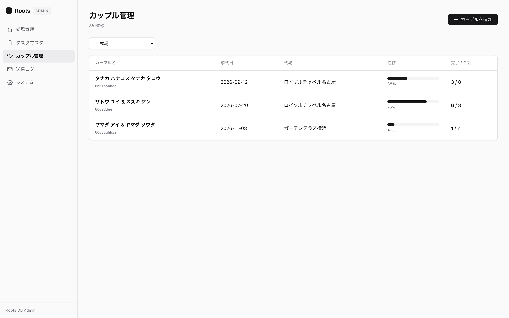

### 画面の見方（表の列）

| 列 | 内容 |
|---|---|
| **カップル名** | 「花嫁カナ ＆ 花婿カナ」。未入力の場合は `line_id` を表示。下段に LINE ID。 |
| **挙式日** | 期限計算の基準になる日付。 |
| **式場** | 紐づく式場名。 |
| **進捗** | 完了率のバーと % 表示。 |
| **完了 / 合計** | 完了タスク数 / 対象タスク総数。 |

上部のドロップダウンで**式場による絞り込み**ができます。見出し下に「**◯組登録**」。

### 3-1. カップルを追加する

1. 右上の「**＋ カップルを追加**」をクリック。
2. フォームが開きます。

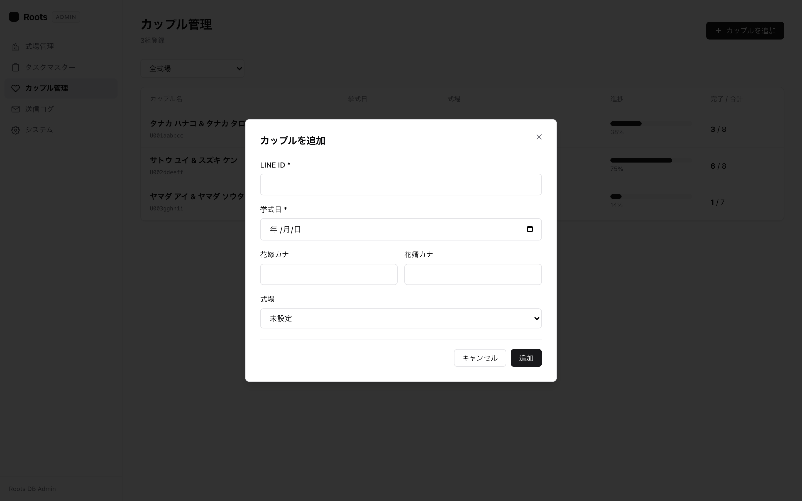

| 項目 | 必須 | 説明 |
|---|---|---|
| **LINE ID** | ✅必須 | カップルを識別するLINEのユーザーID。 |
| **挙式日** | ✅必須 | 期限計算の基準。カレンダーから選択。 |
| **花嫁カナ / 花婿カナ** | 任意 | 表示名・宛名に使用。 |
| **式場** | 任意 | 紐づける式場。未設定も可。 |

3. 「**追加**」で登録。
   - 登録時、**該当タスクの手配物テンプレートが自動でこのカップルにコピー**されます（[付録B](#付録b-手配物テンプレートの自動コピーの仕組み)）。

### 3-2. カップルの詳細を見る・編集する

一覧の**行をクリック**すると、中央に大きな詳細シートが開きます。

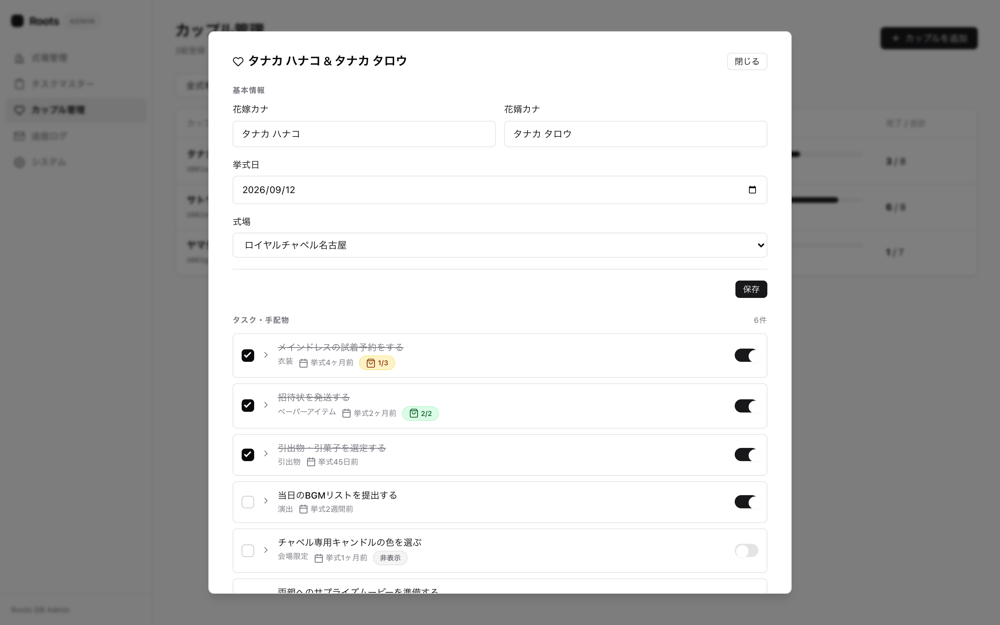

シートは上から3つのセクションで構成されます。

#### ① 基本情報
花嫁カナ・花婿カナ・挙式日・式場を編集できます。変更したら「**保存**」（挙式日を変えると期限計算もすべて更新されます）。

#### ② タスク・手配物
このカップルの全タスクが一覧表示されます。各タスク行でできること：

- **左のチェックボックス**：タスクの**完了/未完了**を切り替え（一覧の進捗％に即反映）。
- **▸ 矢印 / 行クリック**：手配物パネルを開閉。
- **バッジ**：`個別`（このカップル専用タスク）、`非表示`（カップルのアプリ側に出さない）、🛍`◯/◯`（手配物の完了数）。
- **右のトグル**：**表示 / 非表示**の切替（カップル側アプリでの表示制御）。
- **削除**：個別タスクのみ表示。

#### ③ 進捗をリセット
最下部の「**⚠ 進捗をリセット**」（赤）は、このカップルの**完了チェックをすべて削除**します。取り消せないため確認ダイアログが出ます。

### 3-3. 手配物を編集する

タスクの行を開くと、手配物パネルが展開します。

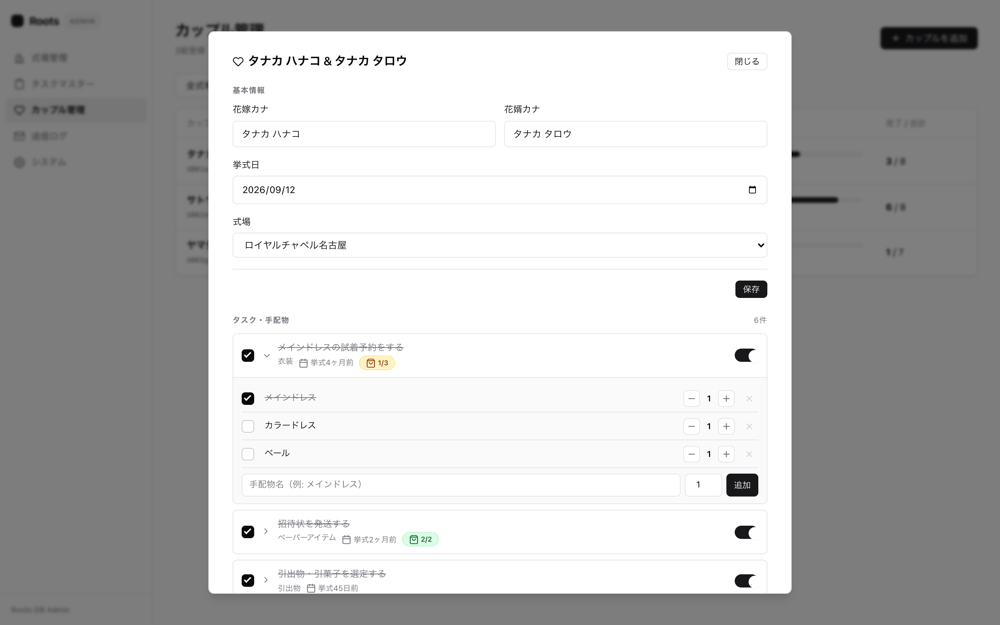

各手配物の行でできること：
- **チェックボックス**：手配物の完了/未完了（タスクの 🛍`◯/◯` バッジに反映）。
- **名称**：クリックして編集（フォーカスを外すと保存）。
- **－ / ＋**：数量の増減。
- **✕**：削除。
- **最下段の入力欄**：手配物名＋数量を入れて「**追加**」で新規手配物を追加。

### 3-4. このカップルにだけタスクを追加する（個別タスク）

タスク一覧の下にある「**＋ このカップルにタスクを追加**」を開き、カテゴリ・期限目安・タスク内容を入れて「追加」すると、**このカップル専用のタスク**が作られます（`個別` バッジが付きます）。

---

## 4. 送信ログ

**カップルへ送る LINE メッセージ（ドラフト）の確認・編集・状態管理を行うメニューです。**

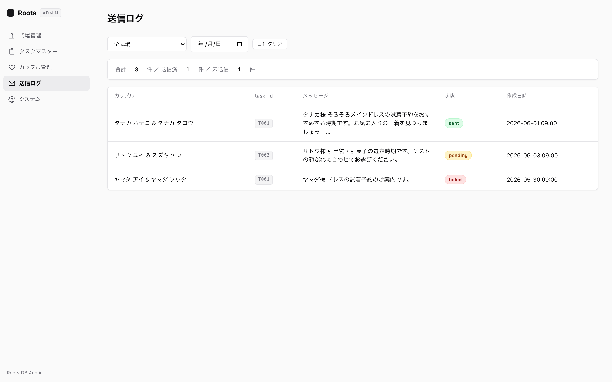

### 画面の見方

- **フィルタ**（上部）：
  - **式場**：式場で絞り込み。
  - **日付**：作成日で絞り込み（**初期値は当日**）。「**日付クリア**」で全期間表示に戻ります。
- **サマリーバー**：合計 / 送信済 / 未送信 の件数。
- **表の列**：カップル名、task_id、メッセージ（抜粋）、状態、作成日時。
- **状態バッジ**：`sent`（緑＝送信済）／`pending`（オレンジ＝未送信）／`failed`（赤＝失敗）。

> 開いた直後に件数が少ない場合は、**日付フィルタが当日になっている**可能性があります。「日付クリア」を押すと過去のログも表示されます。

### 4-1. ドラフトの詳細を見る・編集する

行をクリックすると、右側にドラフト詳細ドロワーが開きます。

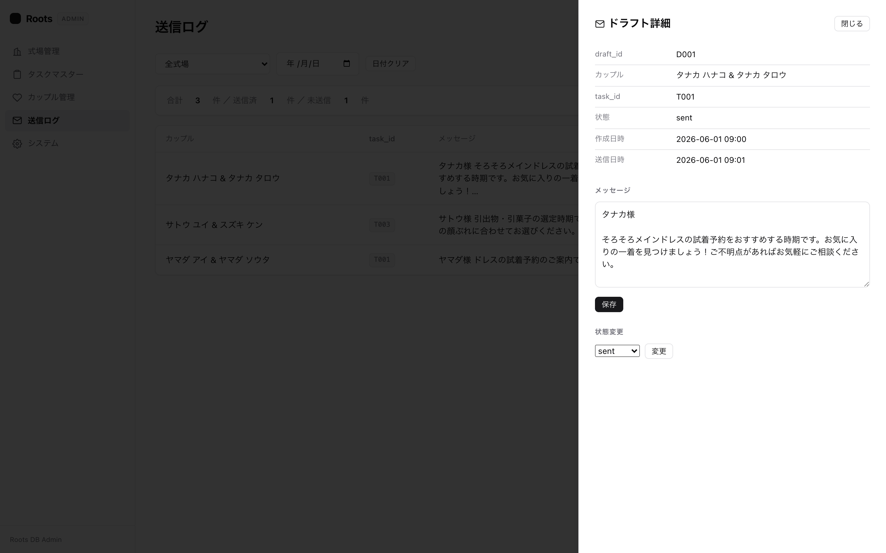

- **情報欄**：draft_id、カップル、task_id、状態、作成日時、送信日時。
- **メッセージ**：本文をその場で編集して「**保存**」。
- **状態変更**：プルダウンで `pending / sent / failed` を選び「**変更**」。
  - `sent` に変更すると**送信日時が自動で記録**されます。

> ⚠️ この画面の「状態変更」は**記録上のステータスを書き換える操作**です。実際の LINE 送信は[システム操作](#5-システム操作)のリマインド機能や自動トリガーが行います。

---

## 5. システム操作

**運用の裏側にあたる一括処理・初期設定を行うメニューです。** 影響が大きいため、各操作は確認ダイアログ付きです。

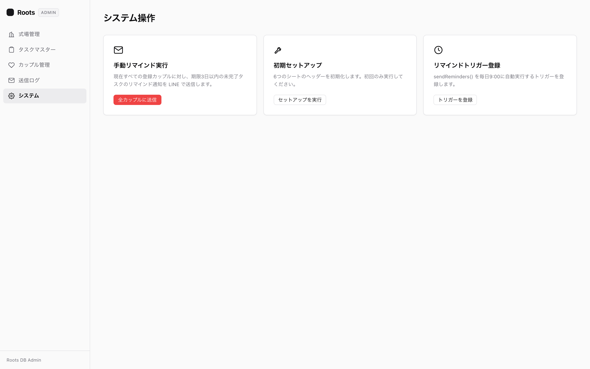

3つのカードがあります。

### 5-1. 手動リマインド実行（赤ボタン）
登録されている**全カップル**に対し、**期限3日以内の未完了タスク**のリマインドを **LINE で即時送信**します。
「全カップルに送信」→ 確認ダイアログ「本当に全カップルにリマインドを送信しますか？」→「実行する」。

> ⚠️ 実際にLINEへ送信されます。日々の自動送信は [5-3] のトリガーに任せ、この手動実行は補助的に使ってください。

### 5-2. 初期セットアップ
スプレッドシートの各シートの**ヘッダー（見出し行）を初期化**します。**システム導入時の初回のみ**実行してください。
「セットアップを実行」→ 確認 →「実行する」。

### 5-3. リマインドトリガー登録
リマインド送信処理（`sendReminders()`）を**毎日 9:00 に自動実行**するトリガーを登録します。
「トリガーを登録」→ 確認 →「実行する」。一度登録すれば、以降は毎朝自動でリマインドが走ります。

各操作の結果は、ボタン下に緑（成功）／赤（失敗）のメッセージで表示されます。

---

## 6.（参考）タスクカレンダー

> 🔧 **現在このメニューはサイドバーから非表示**になっています（将来の機能候補として、機能自体は残されています）。下記は参考情報です。

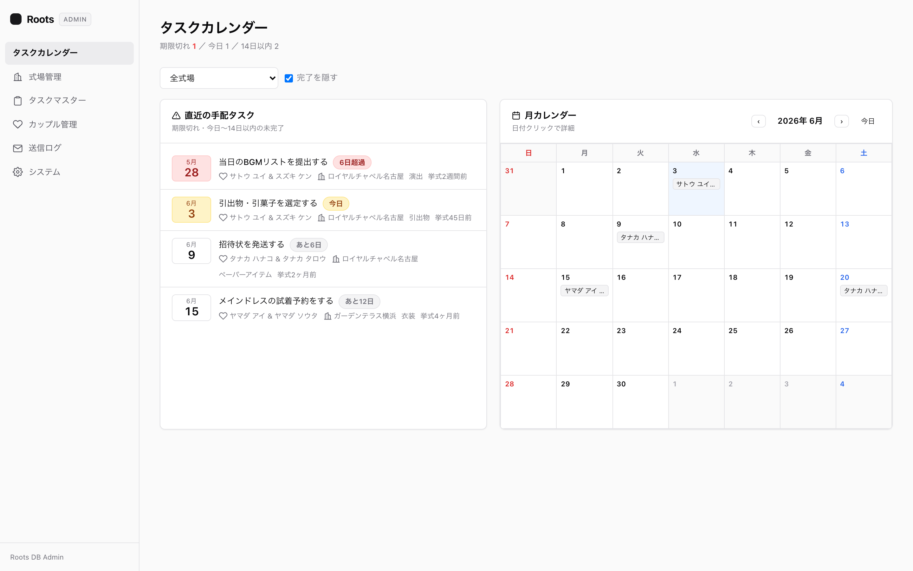

全カップル × 全タスクの期限を、**挙式日と期限式から自動計算**して一覧・カレンダー表示する画面です。

- **左：直近の手配タスク**：期限切れ＋今日〜14日以内の未完了タスク。`◯日超過`（赤）／`今日`（オレンジ）／`あと◯日` のバッジで緊急度が分かります。行クリックでそのカップルの詳細へ。
- **右：月カレンダー**：日付セルにタスクがチップ表示されます。`‹ ›` で月移動、「今日」で当月へ。日付クリックでその日のタスク一覧ドロワー。
- **フィルタ**：式場での絞り込み、「完了を隠す」チェック。
- 見出し下に「期限切れ ◯ ／ 今日 ◯ ／ 14日以内 ◯」のサマリー。

> 表示には各カップルに **挙式日** が、各タスクに **期限式（due_formula）** が設定されている必要があります（どちらか欠けると、そのタスクはカレンダーに出ません）。

---

## 7. はじめての導入フロー（推奨手順）

初めて運用を始めるときは、次の順番がスムーズです。

1. **［システム操作］初期セットアップ** を実行（シートのヘッダー初期化・初回のみ）。
2. **［タスクマスター管理］base task を整備**（標準タスクを追加。必要なら手配物テンプレートも設定）。
3. **［システム操作］リマインドトリガー登録**（毎朝9:00の自動送信を有効化）。
4. **［式場管理］式場を追加**（「追加 + タスク初期化」で base task が自動コピーされます）。
   - 式場ごとに**プランナーLINE ID**と**チャネルアクセストークン**を設定。
5. **［タスクマスター管理］必要に応じて式場別タスクを追加**。
6. **［カップル管理］カップルを追加**（挙式日・式場を設定。手配物テンプレが自動コピーされます）。
7. 運用開始後：
   - base task を増やしたら **［タスクマスター管理］全式場に同期** を実行。
   - 日々の進捗は **［カップル管理］** で確認・チェック。
   - 送信内容は **［送信ログ］** で確認・微修正。

---

## 8. よくある質問・トラブルシューティング

**Q. 式場を追加したのにカップル側にタスクが出ない。**
A. 式場追加時に base task はコピーされますが、既存の base task 変更後は「**全式場に同期**」が必要です。また、カップルに**挙式日**が未設定だと期限が計算されません。

**Q. LINEテスト送信でエラーになる。**
A. 対象式場に「**プランナー LINE User ID**」と「**LINEチャネルアクセストークン**」が両方設定されているか確認してください。base task（式場未選択）では送信できません。

**Q. 送信ログがほとんど表示されない。**
A. **日付フィルタが当日**になっています。「**日付クリア**」を押すと全期間が表示されます。

**Q. カレンダー（タスクカレンダー）にタスクが出ない。**
A. 該当メニューは現在非表示です。また、表示にはカップルの**挙式日**とタスクの**期限式**が必要です。

**Q. 手配物テンプレートが特定のカップルにコピーされない。**
A. そのテンプレートが**別の式場専用タスク**に紐づいている場合、式場が一致するカップルにのみコピーされます。また、同名の手配物が既にある場合は重複コピーされません（[付録B](#付録b-手配物テンプレートの自動コピーの仕組み)）。

**Q. 操作したのに反映されない／古い内容が出る。**
A. 表示高速化のためのキャッシュが残っている可能性があります。上部に黄色い帯が出ているときは更新中です。少し待つか、メニューを切り替えて開き直してください。

**Q. チェックを間違えて全部消したい／やり直したい。**
A. カップル詳細シート下部の「**進捗をリセット**」で、そのカップルの完了チェックを全削除できます（取り消し不可）。

---

## 付録A. 期限式（due_formula）の書き方

期限式は、各カップルの**挙式日を基準に締切日を自動計算**するための式です。タスクごとに設定します。

- 書式の例：`挙式日 - 120日`、`挙式日 - 60日`、`挙式日 - 14日`
- 意味：「挙式日の◯日前」を、そのカップルの締切日として計算します。
- **期限目安（due_estimate）** は人が読むためのラベル（例：挙式2ヶ月前）で、計算には使われません。両方を設定しておくと、計算の正確さと表示の分かりやすさを両立できます。

> 期限式が未設定のタスクは、タスクカレンダー等の「期限による並び・通知」の対象になりません。

---

## 付録B. 手配物テンプレートの自動コピーの仕組み

手配物テンプレートは「タスクに紐づく手配物のひな型」です。次のタイミングで各カップルへコピーされます。

- **カップルを新規登録したとき**（そのカップルに関係するタスクのテンプレを自動コピー）
- **［タスクマスター管理］全式場に同期 を実行したとき**（全カップルへまとめて反映）

コピー時のルール：

1. テンプレートが紐づくタスクが存在しない場合 → スキップ。
2. テンプレートが**別の式場専用**タスクに紐づいていて、カップルの式場と一致しない場合 → スキップ。
3. そのカップルに**同じタスク × 同じ手配物名**が既にある場合 → 重複を避けてスキップ。
4. 上記以外 → 手配物としてカップルにコピー（数量も引き継ぎ）。

> つまり、**標準の持ち物はテンプレートで一括管理**し、カップル個別の事情は[カップル詳細シート](#3-3-手配物を編集する)で個別に増減する、という運用が基本になります。

---

*このマニュアルのスクリーンショットは、サンプルデータで描画した管理画面のものです。実際の表示は登録データによって変わります。*
